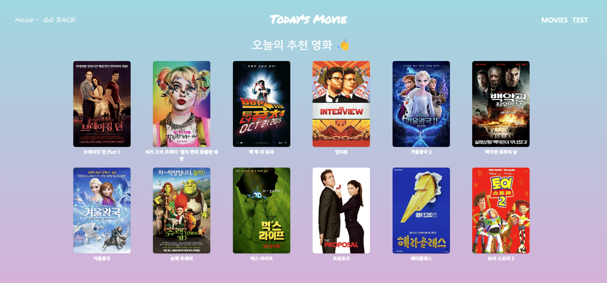

# 설문 기반 영화 추천 서비스 <오늘의 영화>

2022.11 ~ 2022.11 (1주, 개인)

### 서비스 소개✍️

- 오늘의 기분, 날씨, 여유 시간, 영화 메이트 등을 기반으로 추천 알고리즘을 통해 약 10개의 영화를 추천
- 추천된 영화의 상세 정보 확인 가능 (영화 장르, 소개, 포스터, 런타임 등)
- 간단한 영화 후기와 후기에 좋아요를 남길 수 있음
- 메인 페이지에서는 인기 영화 Top100을 확인 가능
- 프로필에서 찜한 영화와 내가 남긴 후기들을 모아 볼 수 있음
- 영화 검색 기능 지원 (약 5000개의 영화 정보 수집)

### **GitHub & README**📖

[https://github.com/BudDiary/BudDiary](https://github.com/BudDiary/BudDiary)

### **담당 역할🫡**

- DB 모델링
- RESTful API 설계
- Back-End 개발 & Front-End 개발
- 데이터 수집 - IMDb 영화 데이터 사용

### **기술 스택🔧**

- **General**
    - GitLab

- **Language**
    - Python
    - JavaScript

- **Database**
    - SQLite

- **Back-End**
    - Django
    

- **Front-End**
    - Vue.js
    - Vuex

### **구현 사항💻**

(FE & BE 모두)

- 설문 기반 영화 추천 알고리즘 구현
- 상세 영화 정보 보기
- 영화 찜하기 기능
- 영화 후기 작성, 수정, 삭제 기능
- 영화 후기 좋아요 기능
- 프로필에서 찜한 영화, 내가 작성한 후기 불러오기 기능
- 회원가입 기능 & 로그인, 로그아웃 기능
- 영화 후기 클릭하여 상대방 프로필 확인 기능

### **프로젝트 성과 및 리뷰🏆**

- 그동안 배운 언어, 프레임워크를 활용해 RESTFul API를 설계하고 직접 구현해보는 좋은 기회였다.
- 처음 하는 프로젝트여서 기획, 설계 단계에서 많이 어려웠다. 생각보다 세부적인 내용까지 꼼꼼하게 설계하는 것이 필요하다는 것을 느꼈다.
- ERD 설계 > 데이터 수집 > Back-End 개발 > Front-End 개발 순으로 진행하였는데, 기능 하나하나 조립해 나가며 성취감을 느낄 수 있었다.

### ERD💡

### 서비스 화면📺

### 서버 실행 방법

- final-pjt-back에서 진행
    - python -m venv venv
    - source venv/Scripts/activate
    - python manage.py makemigrations
    - python manage.py migrate
    - python manage.py loaddata movies/fixtures/genres.json movies/fixtures/movies.json
    - python manage.py runserver
    - npm run serve
- final-pjt-front에서 진행
    - npm install
    - npm runserve